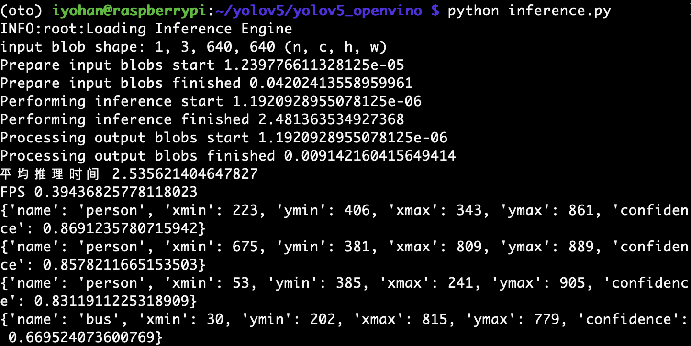

# Inference of Large-scale Models using Low-resource and Low-power IoT Devices in Edge-cloud Environment: Taking the deployment of Yolo V5 on Raspberry Pi 4B as an example

## Members

Xiangchi Song (xcsong@kaist.ac.kr)

Yohan Lee (iyohan@kaist.ac.kr)

## Abstract

In response to the increasing demand for application services and data in recent years, we propose a method for inference of large-scale models using low-resource and low-compute IoT devices in edge-cloud environment. The proposed method uses a lightweight model for preliminary processing on the IoT devices, and then offloads the remaining inference tasks to the cloud.
Regarding the project we worked on, we ultimately chose to adopt YOLOv5, which was released on October 13, 2021. This new version, built upon V5.0, integrates numerous new features and incorporates adjustments to the network architecture. Additionally, it introduces a brand new, smaller model known as YOLOv5 Nano.
Given the objective of our project, which is Object Detection and Behavior Recognition in Complex Backgrounds, we selected YOLOv5 as the foundational framework for our target recognition. During this process, we opted to leverage certain tools from OpenVINO 1 for optimizing and deploying artificial intelligence (AI) inference. We utilized ONNX 2 to convert the AI models into the Intermediate Representation (IR) format, which facilitated the deployment onto the Neural Compute Stick (NCS). OpenVINO's tools played a crucial role in optimizing the models for efficient inference on edge devices, enabling us to harness the power of AI in a more compact and specialized hardware setup. To implement large-scale neural network models on edge devices, we employed foundational techniques such as model compression, model distillation, and distributed inference methods. To simulate large-scale neural network inference, we utilized the Raspberry Pi 4B as an Internet of Things (IoT) device.
Based on the final network parameter information and the observed video output results, it can be concluded that our approach is both reasonable and effective.

## 1. Test and Validate on pre-built system

### 1-1. Access Raspberry Pi 4B using SSH

1. Open terminal (SSH client must be installed), and type as below

```bash
$ ssh iyohan.iptime.org -p 1024
```

1. Type password (10241024) and press enter.

### 1-2. Move to YoloV5 directory

```bash
$ cd /home/iyohan/yolov5_cloudedge/yolov6_openvino_cloudedge
```

### 1-3. Making inference

```bash
$ python inference.py
```

### Example



## 2. Test and validate on your own Raspberry Pi 4B from scratch

### 2-1. Raspberry Pi 4B setup

1. Install Raspbian OS 64bit
2. Install VNC client in your PC or Mac for remote control of Raspberry Pi 4B (if needed) 
3. Install [Miniconda (Mambaforge)](https://github.com/conda-forge/miniforge)
4. Create a new conda environment with Python 3.9 
    
    ```bash
    $ conda create -n edge python==3.9
    ```
    
5. Download our repository
    
    ```bash
    $ git clone https://github.com/ultralytics/yolov5  # clone repo
    ```
    
6. Install libraries using requirement.txt
    
    ```bash
    $ cd <path to repo>
    $ pip install -r requirements.txt
    ```
    
7. Download OpenVINO version 2022.3 and Install.
    
    Follow the instructions in this link: https://docs.openvino.ai/2022.3/openvino_docs_install_guides_installing_openvino_raspbian.html#doxid-openvino-docs-install-guides-installing-openvino-raspbian
    
8. If successfully installed, 
    1. Activate conda environment
    2. OpenVINO must be initialized
        
        ```bash
        source <path to OpenVINO directory>/setupvars.sh
        ```
        
    3. (recommended) Automate the shell script running when the conda env is activated 
    https://chat.openai.com/share/3a1c76ca-07e6-421d-98e6-ccf1b5c8bd16 
9. Run
    
    ```bash
    $ cd <path to our repo>/yolov4_openvino
    $ python inference.py
    ```